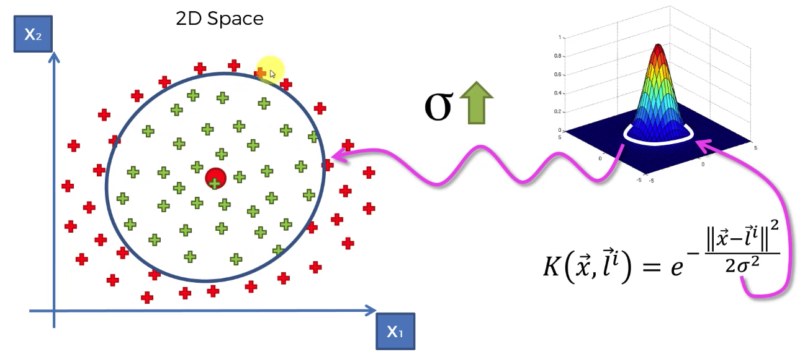
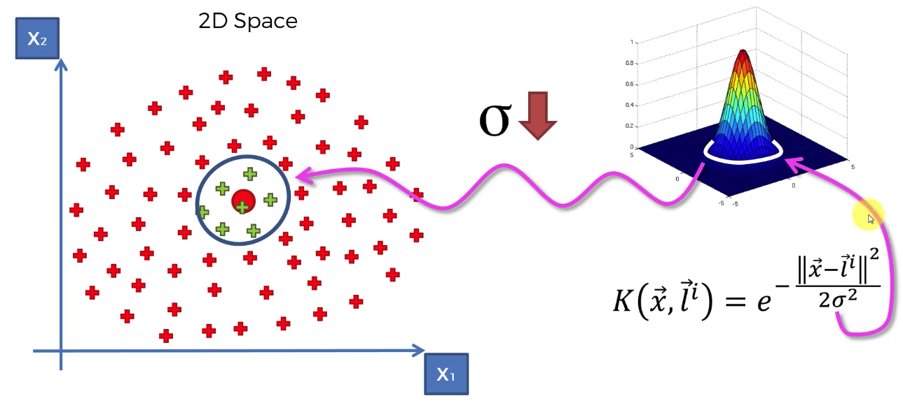
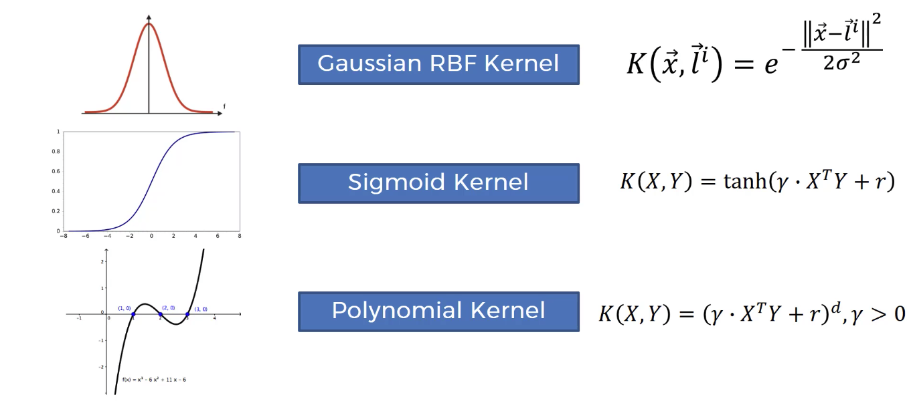
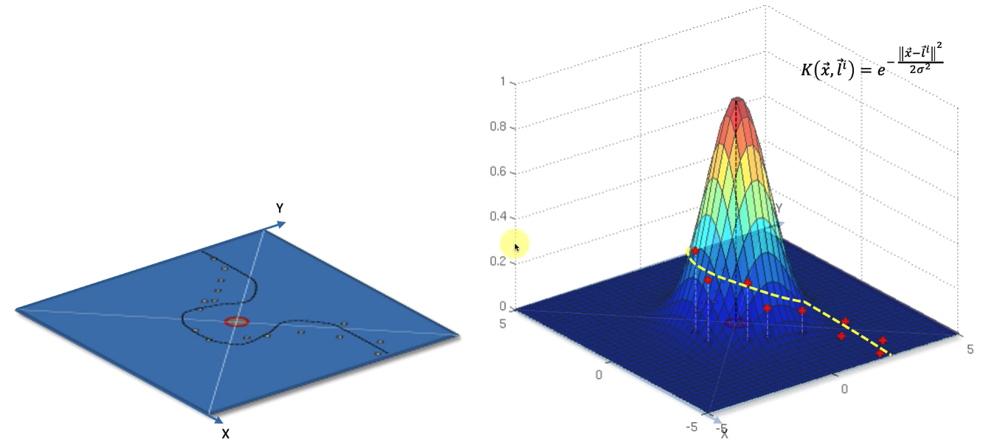
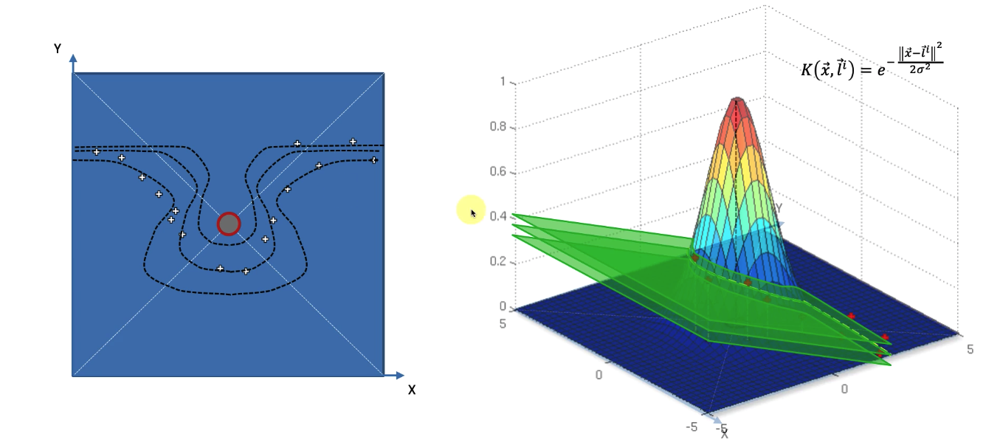

# Kernel SVM

## **Implementation**

- ## Importing the libraries
	```py
	import numpy as np
	import pandas as pd
	import matplotlib.pyplot as plt
	```

- ## Importing the dataset
	```py
	dataset = pd.read_csv('Social_Network_Ads.csv')
	X = dataset.iloc[:, :-1].values
	y = dataset.iloc[:, -1].values
	```

- ## Splitting the dataset into the Training set and Test set
	```py
	from sklearn.model_selection import train_test_split
	X_train, X_test, y_train, y_test = train_test_split(X, y, test_size = 0.25, random_state=0)
	```

- ## Feature Scaling
	- Here Feature Scaling is not mandatory, but applying it can improve training performance.
	- In SVR, it was necessary. but here it is not.
	- Here we are doing Feature Scaling after splitting the dataset, in order to  avoid information leakage.
	```py
	from sklearn.preprocessing import StandardScaler
	sc = StandardScaler()
	X_train = sc.fit_transform(X_train)
	X_test = sc.transform(X_test)
	```
	
- ## Training the Kernel SVM model on the Training set
	- Here metric set to `minkowski` and p=2 means equivalent to the **STANDARD EUCLIDEAN METRIC**.
	```py
	from sklearn.svm import SVC   # Support Vector Classifier
	classifier = SVC(kernel='rbf', random_state=0)   # Choosing the Radial Basis Kernel which is by default! anyways... :)
	classifier.fit(X_train, y_train)
	```	
- ## Predicting a new result
	- Here there are three functions for predicting the results
		1. `predict()`
		2. `predict_log_proba()`
		3. `predict_proba()`
	- ### 1. predict() : 
		```py
		classifier.predict(sc.transform([[36,144000]]))   # test set sample without feature scaling
		```

	- ### 2. predict_proba() : 
		> Not Applicable for this.
		
		> Will give two values : first one is for `0`, second one is for `1`
		```py
		classifier.predict_proba(sc.transform([[36,144000]]))
		```

- ## Predicting the Test set results
	```py
	y_pred = classifier.predict(X_test)
	```

	- Priting predicted result and actual result side by side : 
	```py
	print(
    np.concatenate(
        ( y_pred.reshape(len(y_pred),1) , y_test.reshape(len(y_test),1) ) , 1
      )
     )
	```

- ## Making the Confusion Matrix

	- Priting the Confusion matrix and Accuracy Score
	```py
	from sklearn.metrics import confusion_matrix, accuracy_score
	cm = confusion_matrix(y_test, y_pred)
	print(cm)
	ac = accuracy_score(y_test, y_pred)
	print(ac)
	```


---

## Understanding why we need kernel

- SVM cannot work when data is not **Linearly Separable**
- For data which is not linearly separable, Kernel SVM comes in action!
- We have to map function to higher dimension in order to separate the data.
	> In this case, If we are going from 2D to 3D then the separator will be Hyperplane instead of Line.
- Mapping to a higher Dimensional Space can be highly compute-intensive

## The Gaussian RBF Kernel

> (Radial Basis Function)
	
- With help of this, we can classify the data without mapping our function to higher dimension


- This is only a visual representation. we are not going in 3D from 2D

| Increase Sigma value | Decrease Sigma value |
|---|---|
|  |  |

- Different types of kernel
	 

	- [Learn more...](https://datafreakankur.com/machine-learning-kernel-functions-3d-visualization/)

# Non-Linear SVR

-  

-  


---

- # `Social_Network_Ads.csv`
	- First 10 rows ...
	
|Age|EstimatedSalary|Purchased|
|---|---------------|---------|
|19 |19000          |0        |
|35 |20000          |0        |
|26 |43000          |0        |
|27 |57000          |0        |
|19 |76000          |0        |
|27 |58000          |0        |
|27 |84000          |0        |
|32 |150000         |1        |
|25 |33000          |0        |
|35 |65000          |0        |