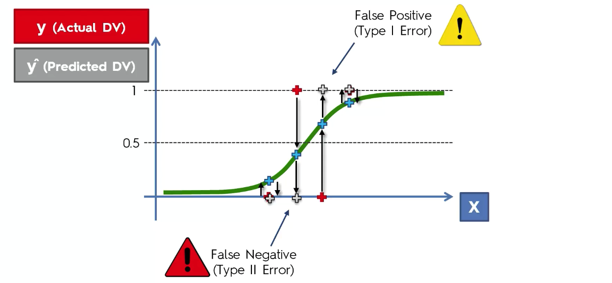
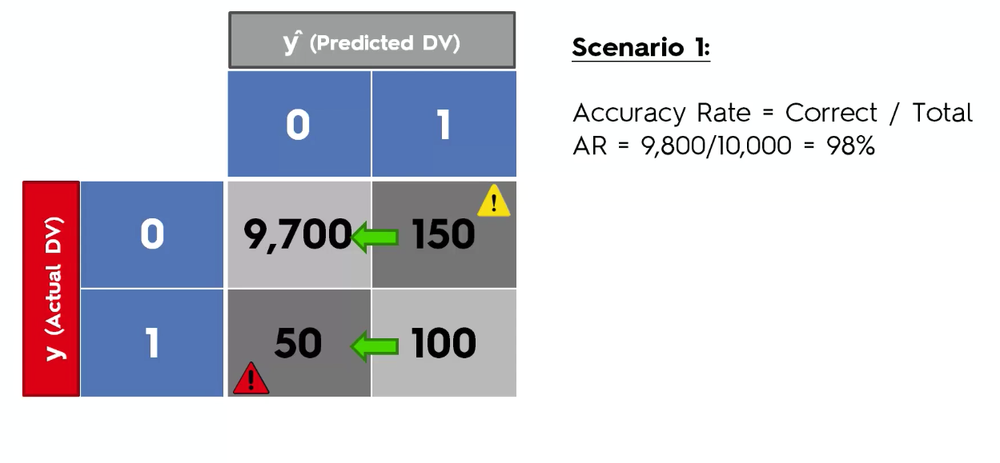
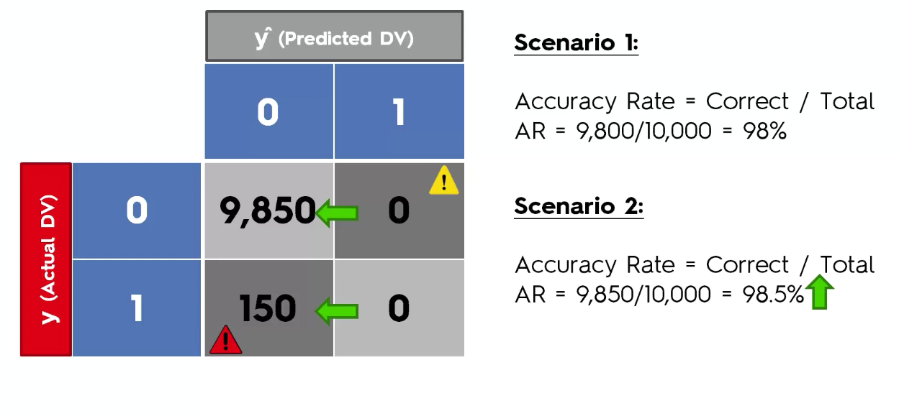
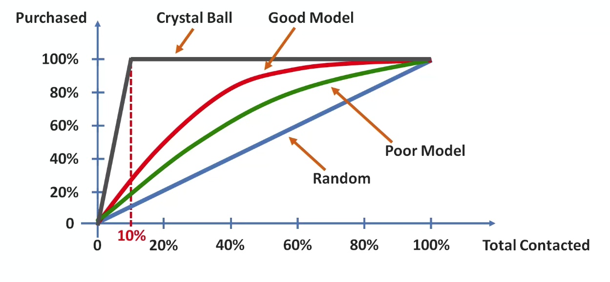
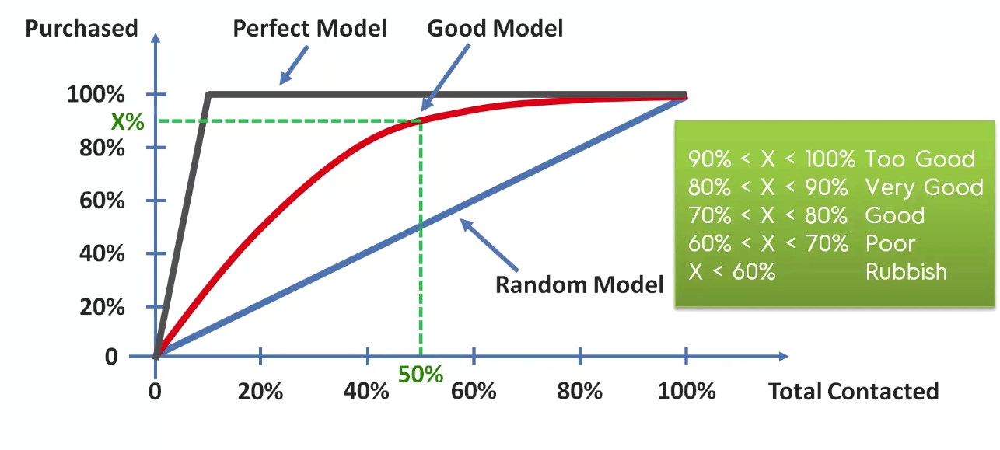

# Evaluating Classification Model Performance 

## False Positive & False Negatives
	- Type I  error : False Positive
	- Type II error : False Negative
	
| Representation in Logistic Regression |
|---|
||

## Confusion Matrix
- DV : Dependent Variable

||**y^**|**(Predicted DV)**||
|---|---|---|---|
| | |*0*|*1*|
|**y**|*0*|35|5|
|**(Actual DV)**|*1*|10|50|

- Here : 
	- `35`: True Negative
	- `50`: True Positive
	- `5`: False Positive 	*(Type I error)* <u>Orange Alert (can cause less harm)</u>
	- `10`: False Negative 	*(Type II error)* <u>Red Alert (can cause more harm)</u>
	
	- Accuracy Rate : Correct/Total
		- AR : 85/100 = 85%
	- Error Rate : Wrong/Total
		- ER : 15/100 = 15%
	
	
## Accuracy Paradox

- When we remove our model and decide to always predict `zero`, then accuracy is increasing which is confusion! this should not happen. 

| Before | After setting prediction always to 0 |
|---|---|
|| |

- Solution : Cumulative Accuracy Profile *(Next section)*

##  CAP Curve	*Cumulative Accuracy Profile*

- The better the model, the larger the area will be covered under the CAP curve.

| CAP curve for a new product purchase email |
|---|
||

- CAP : Cumulative Accuracy Profile
	> The CAP of a model represents the cumulative number of positive outcomes along the y-axis versus the corresponding cumulative number of a classifying parameter along the x-axis. The output is called a CAP curve.
	
	> Perfect Model : Crystal ball
- ROC : Receiver Operating Characteristic
	> Graph showing the performance of a classification model at all classification thresholds. This curve plots two parameters: True Positive Rate. False Positive Rate. [Learn more about ROC...](https://towardsdatascience.com/understanding-auc-roc-curve-68b2303cc9c5)
> CAP and ROC are not same.

### Formulas for terms of ROC: 

|Term|Formula|
|---|---|
|TRP (True Positive Rate) / Recall / Sensitivity ||
|Specificity ||
|FPR ||

- CAP analysis
	- If we got above 90%, then there can be *overfitting* or there can be some variable which is looking in feature. so check for that immediately.
	
	