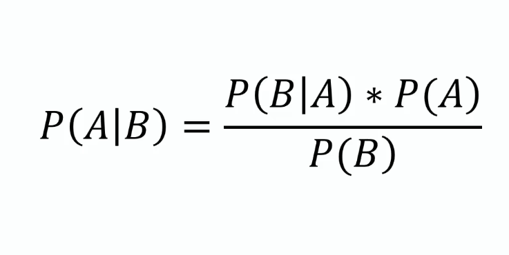
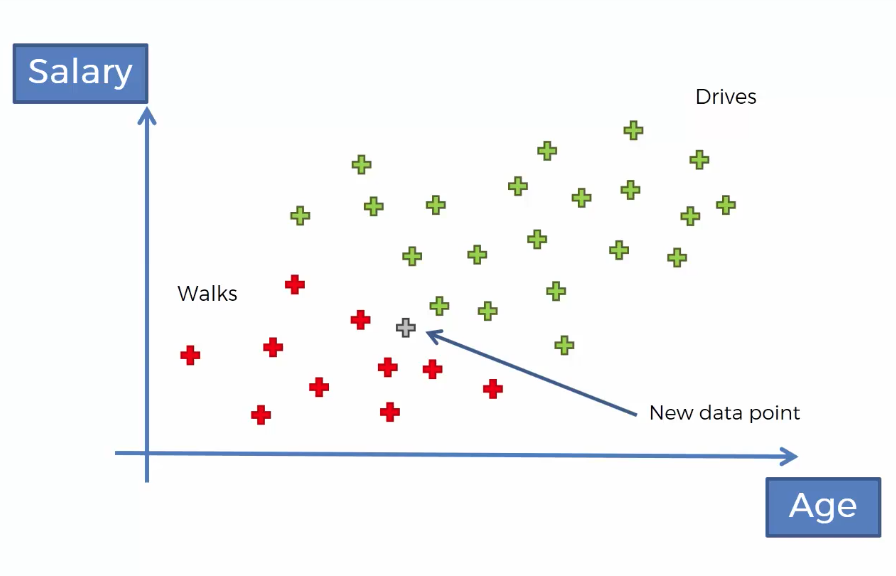
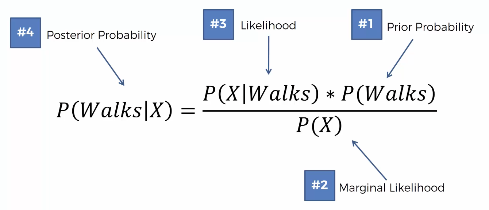
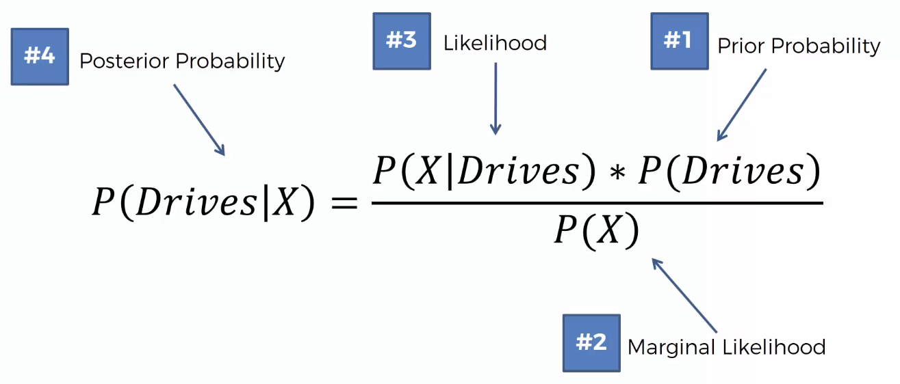
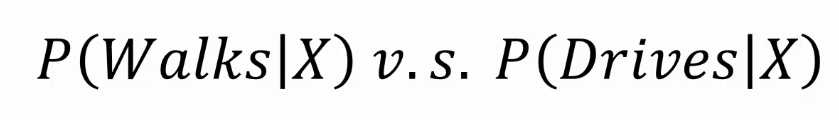

# Naive Bayes

## **Implementation**
- *Other steps are same as previous classifications.*

- ## Training the Naïve bayes model on training set 
	```py
	from sklearn.naive_bayes import GaussianNB  
	classifier = GaussianNB()   
	classifier.fit(X_train, y_train)	
	```

---

- Steps : 
	- Bayes Theorem
		
	- Naive Bayes Classifier
		- Classify as goes to job by `walking` or `driving`
			
			- Step 1
			
			- Step 2
			
			- Step 3
			
	
		- Why *Naïve* ?
			> Independence assumption

---

- # `Social_Network_Ads.csv`

	- First 10 rows ...
	
|Age|EstimatedSalary|Purchased|
|---|---------------|---------|
|19 |19000          |0        |
|35 |20000          |0        |
|26 |43000          |0        |
|27 |57000          |0        |
|19 |76000          |0        |
|27 |58000          |0        |
|27 |84000          |0        |
|32 |150000         |1        |
|25 |33000          |0        |
|35 |65000          |0        |