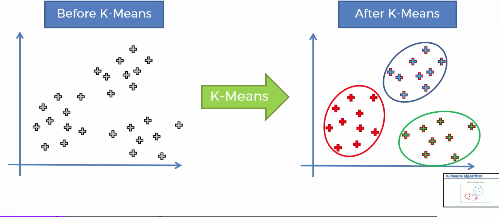
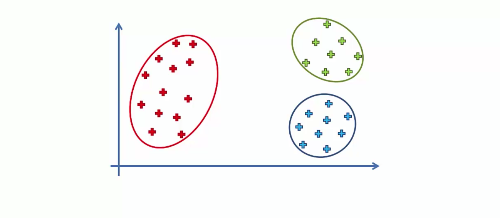
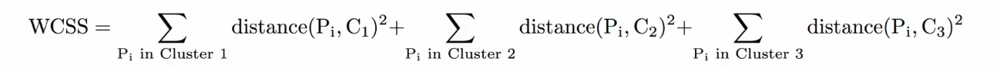
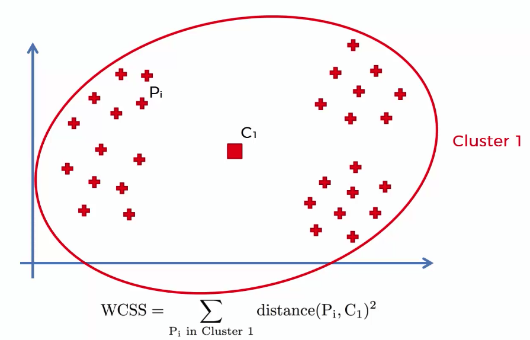
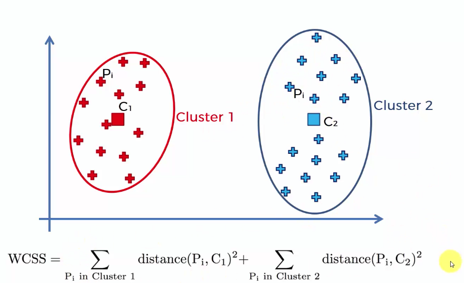
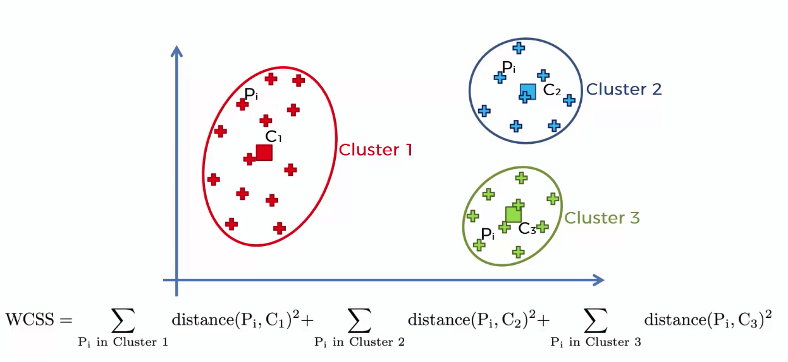
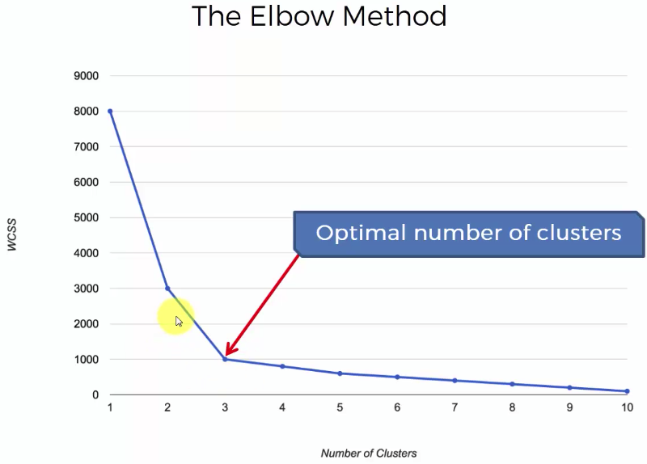

# K-Means Clustering

|What does K-Means Clustering do ?|
|---|
||

- ## Steps : 
	1. Choose the number K of clusters
	2. Select at random K points, the centroids *(not necessarily from your dataset)*
	3. Assign each data point to the closet centroid -> That forms K clusters
	4. Compute and place the new centroid of each cluster
	5. Reassign each data point to the new closed centroid. If any reassignment took place, go to step 4, otherwise go to FIN.
	
- ## K-Means Random Initialization Trap
	- But what would happen if we had a bad random Initialisation ?
	- Two possible cases when different intialization is done : 
	
	| first case | second case |
	|---|---|
	|||
	- Solution -> `K-Means++` 
		> (Automatically applies inside of the application. we don't have to manually apply it.)
		
- ## Choosing the right number of clusters 
	- Method : Within Sum of Squares *(WSS)*
	
	|Formula|
	|---|
	||
	
	| Only 1 cluster : Large WSS value | 2 clusters : Less then 1's WSS value | 3 clusters : Lowest WSS value |
	|---|---|---|
	||||
	
	- We can have as many clusters as the number of data. as we keep increasing the number of cluster, the WSS value will decrease. As we make *clusters equal to the number of data*, the WSS value will be **zero**.
	
	| Elbow Method for choosing the number of clusters |
	|---|
	||
	
---

- # **Implementation**

- ## Importing the libraries
	```py
	import numpy as np
	import pandas as pd
	import matplotlib.pyplot as plt
	```
- ## Importing the dataset
	- Here last column is not actually a `Dependent` variable. so we have to modify some things from our data preprocssing templates (  *conventional method will not apply here:(*  )
	- Take only `two` features if you want to properly visualise the clusters.
	```py
	dataset.pd.read_csv('Mall_Customers.csv')
	X = dataset.iloc[:,:].values
	```

- ## Using the **ELBOW** method to find the optimal number of clusters
	- with **WCSS** method
	- Here for example, `10` iterations for 10 clusters
	- Here init method is by default `k-means++`, which is to avoid random initialisation trap.
	```py
	from sklearn.cluster import KMeans
	wcss = []
	for i in range(10):
		kmeans = KMeans(n_clusters=i+1, init='k-means++', random_state=42) # 42 is a lucky number in math!
		kmeans.fit(X)
		kmeans.append(kmeans.inertia_) 		# `inertia_` is same value as `WCSS`.
	```
	- Plotting elbow graph
	```py
	plt.plot(range(1,11),wcss, color='blue')
	plt.title('The Elbow Method')
	plt.xlabel('The numbere of clusters')
	plt.ylabel('The WCSS values')
	plt.show()
	```
	- Choose the number of clusters based on the generated graph, whenever you see the elbow in the graph.
	
- ## Training the K-Means model on the dataset
	```py
	kmeans = KMeans(n_clusters=5, init='k-means++', random_state=42)
	y_kmeans = kmeans.fit_predict(X)		# Not only fits/trains the model, it also predict and returns the dependent variable.
	
	# Other method : 
	# kmeans.fit(X) 
	# y_kmeans = kmeans.predict(X) 
	```
	
- ## Cluster visualisation *(Only if two features are selected)*
	```py
	plt.scatter(X[y_kmeans==0, 0], X[y_kmeans==0, 1], color='red', s=100, label='Cluster 1')    # `s` means size of the point
	plt.scatter(X[y_kmeans==1, 0], X[y_kmeans==1, 1], color='blue', s=100, label='Cluster 2')
	plt.scatter(X[y_kmeans==2, 0], X[y_kmeans==2, 1], color='green', s=100, label='Cluster 3')
	plt.scatter(X[y_kmeans==3, 0], X[y_kmeans==3, 1], color='cyan', s=100, label='Cluster 4')
	plt.scatter(X[y_kmeans==4, 0], X[y_kmeans==4, 1], color='magenta', s=100, label='Cluster 5')
	plt.scatter(kmeans.cluster_centers_[:,0], kmeans.cluster_centers_[:,1], color='black', s=300, label='Centroid')
	plt.title('Clusters of customers')
	plt.xlabel('Annual Income ($...k)')
	plt.ylabel('Spending Score (1-100)')
	plt.legend()
	plt.show()
	```
	
- # Dataset : `Mall_Customers.csv`
	- First 10 rows ...
	
|CustomerID|Genre |Age|Annual Income (k$)|Spending Score (1-100)|
|----------|------|---|------------------|----------------------|
|0001      |Male  |19 |15                |39                    |
|0002      |Male  |21 |15                |81                    |
|0003      |Female|20 |16                |6                     |
|0004      |Female|23 |16                |77                    |
|0005      |Female|31 |17                |40                    |
|0006      |Female|22 |17                |76                    |
|0007      |Female|35 |18                |6                     |
|0008      |Female|23 |18                |94                    |
|0009      |Male  |64 |19                |3                     |
|0010      |Female|30 |19                |72                    |