# Hierarchical Clustering

## **Intuition**

|What does Hierarchical Clustering do ?|
|---|
|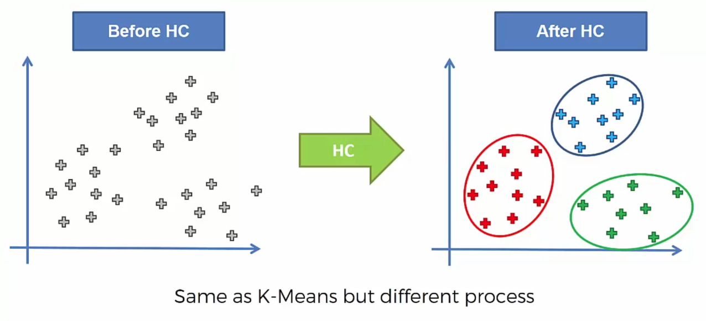|

- ## Two types of hierarchical clustering : 
	- Agglomerative		*(Bottom-up Approach)*
		> Here we'll discuss more about `Agglomerative` approach.
	- Divisive		*(Top-Down Approach)*
	
- ## Agglomerative HC
	1. Make each data point a single-point cluster -> That forms N clusters
	2. Take the two closest data points and make them one cluster -> That forms N-1
	3. Take the two closest clusters and make them one cluster -> That forms N-2
		> Here, method of calculating the distance matters. *(like euclidean distance etc.)*
	4. Repeat *STEP 3* until there is only one cluster
	
	**FINISH**
	
|Euclidean Distance|
|---|
|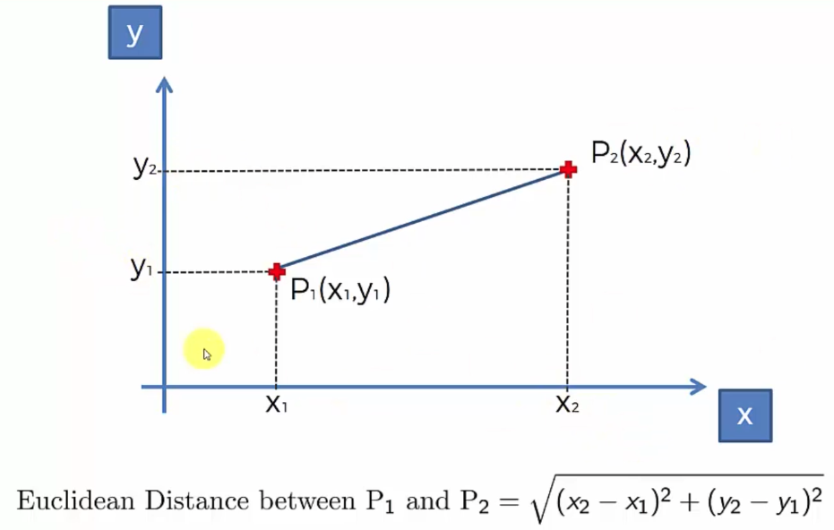|

|Distance between clusters|
|---|
|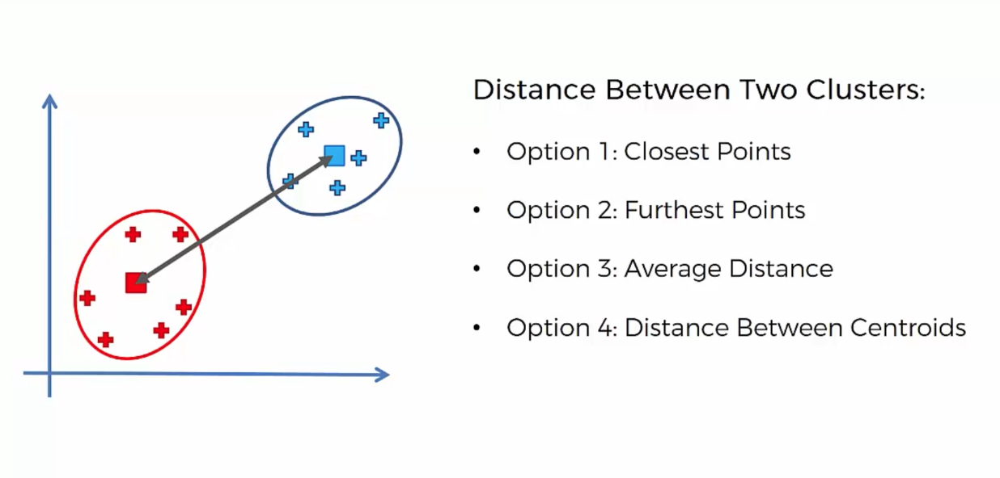|

- Hierarchical clustering maintains the memory of how we formed the different clusters.

## **How do `Dendrograms` works?**

- Dandograms is a kind of memory of HC algorithms which memories how we formed the clusters.
- The height of the bar measures the dissimilarity b/w that two end-points.

- Steps to form Dendrograms : 

|Step 1|Step 2|Step 3|Step 4|Step 5|
|---|---|---|---|---|
|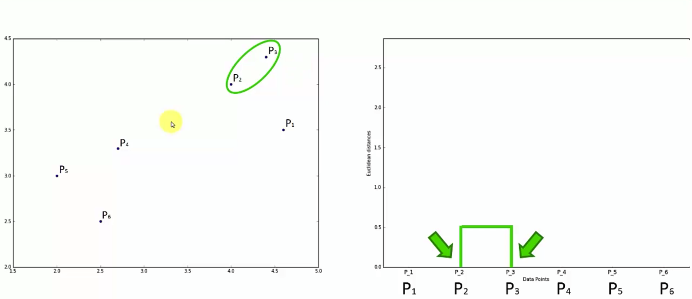|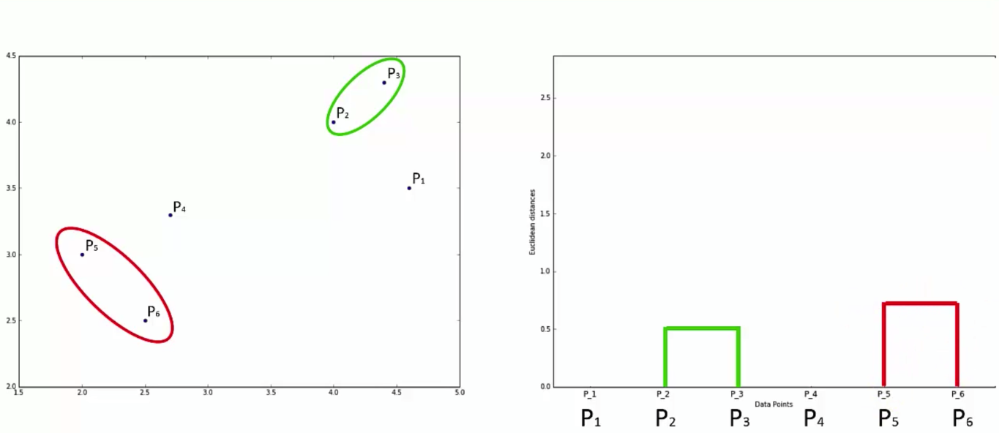|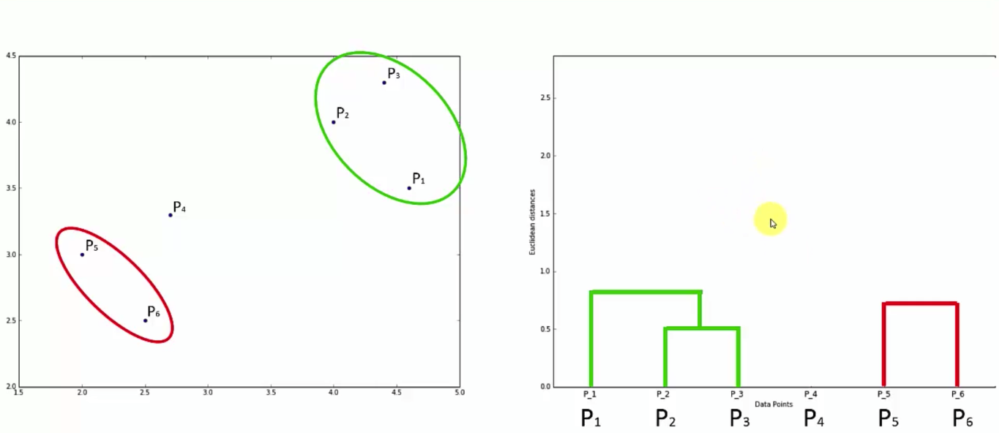|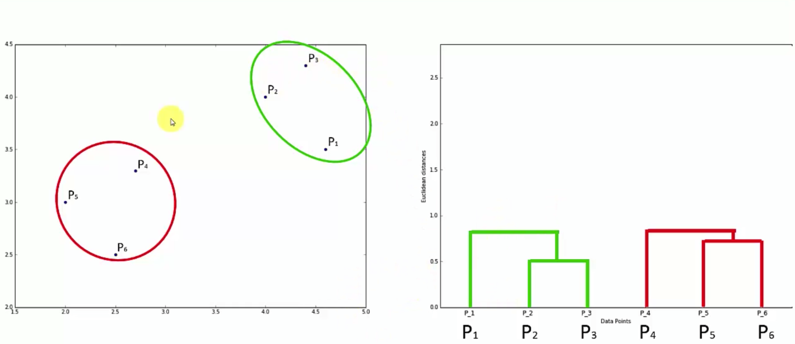|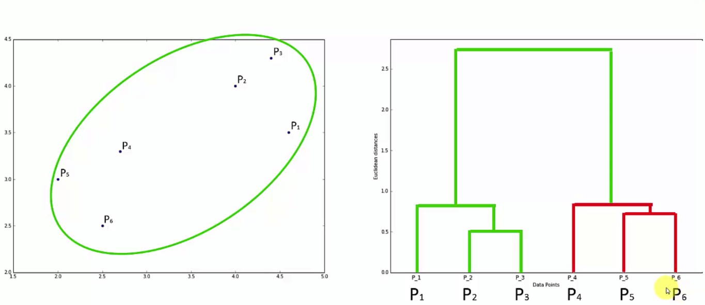|

|FINAL generated **Dendrogram**|
|---|
|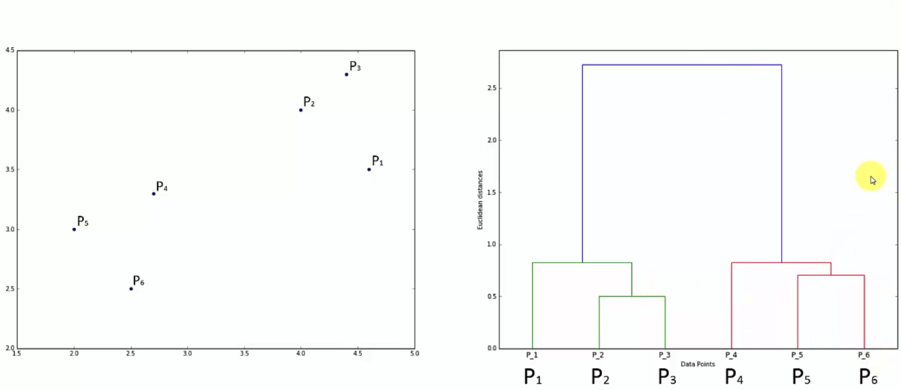|

## Using Dendrograms

- We have to set Distance/Dissimilarity Threshold on Euclidean Distance axis. 
	> The number of vertical lines crosses the threshold line *(Horizontal line)* is equal to the number of cluster at the current threshold we have.
	> Here we have `2` clusters.
	
|2 clusters|4 clusters|6 clusters|
|---|---|---|
|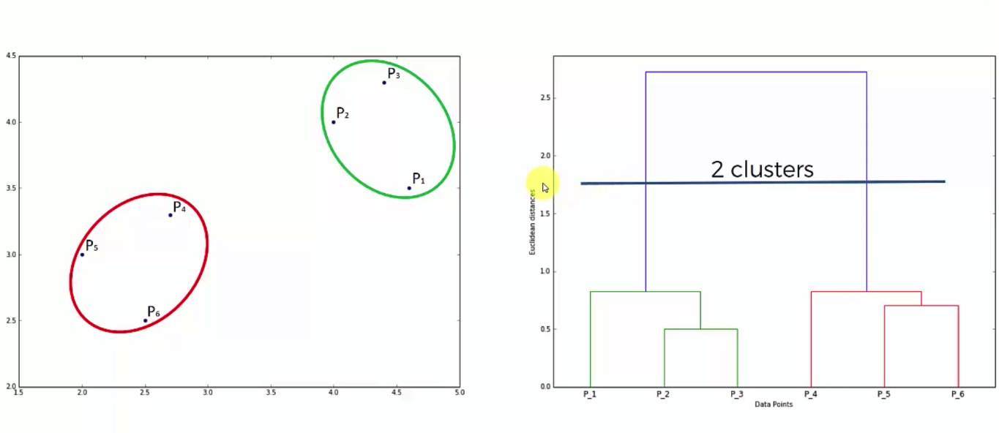|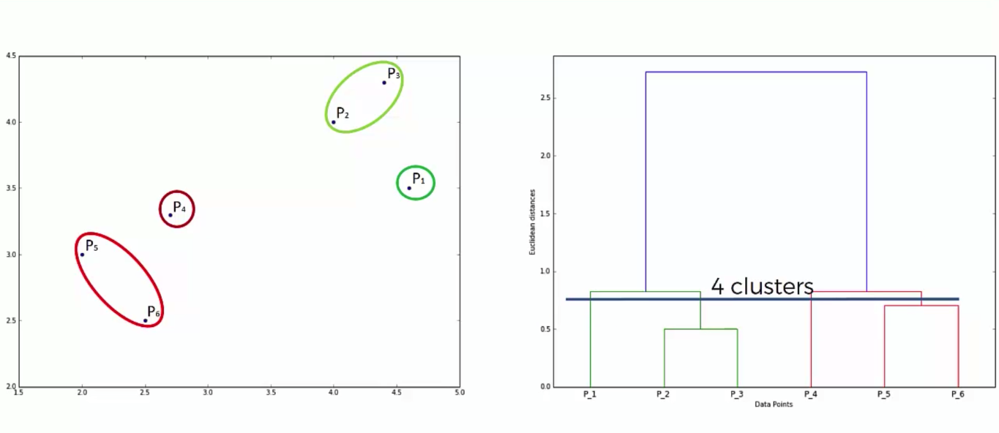|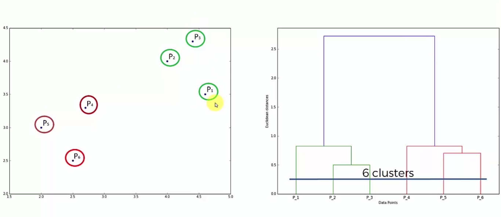|

- As if we are using `ELBOW` method in k-means clustering, to find optimal numbers of clusters, here are using this method to find *Optimal Number Of Clusters*

|Largest distance = optimal number of clusters = 2|
|---|
|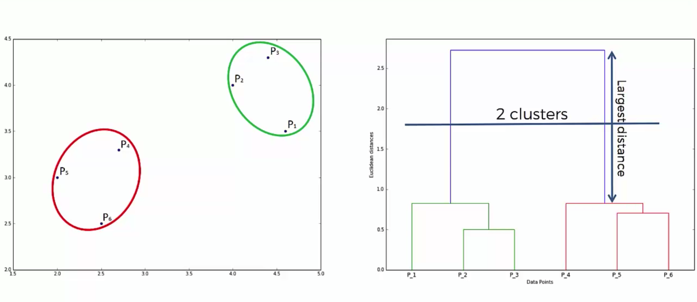|

|Another Example|
|---|
|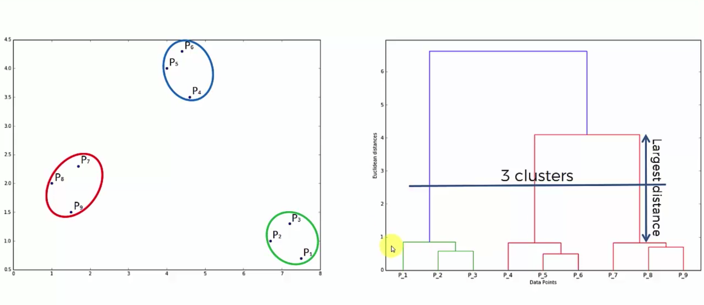|


# Pros and Cons of Clustering models : 

|Clustering Model|Pros|Cons|
|---|---|
|K-Means Clustering|Simple to understand, easily adaptable, works well on small or large datasets, fast, efficient and performant|Need to choose the  number of clusters|
|Hierarchical Clustering|The optimal number of clusters  can be obtained by the model itself, practical visualisation with the dendrogram|Not appropriate for large datasets|

---

# **Implementation**

-  ## Importing the libraries
	```py
	import numpy as np
	import pandas as pd
	import matplotlib.pyplot as plt
	```

-  ## Importing the dataset
	- Only selecting Annual Income and Spending Score in order to visualise clusters.
	```py
	dataset = pd.read_csv('Mall_Customers.csv')
	X = dataset.iloc[:,[3,4]].values
	```

- ## Using the dendrogram to find the optimal number of clusters
	- Here, instead of using `sklearn` library, we are using `scipy` library.
	- Here, we are using `ward` method = Minimum Variance Method. which is very popular, best for Hierarchical clustering.
		> The linkage function specifying the distance between two clusters is computed as the increase in the "error sum of squares" (ESS) after fusing two clusters into a single cluster.
	```py
	import scipy.cluster.hierarchy as sch   # Scipy Clustere Hierarchy
dendrogram = sch.dendrogram(sch.linkage(X, method='ward'))    # method of minimum variance = ward. 

	plt.title('Dendrogram')
	plt.xlabel('The customers')   # Notice that `xlabel` is neither a Annual Income or Spending Score. but it represents the customers(through CustomerID)
	# plt.xlabel('The Observation points') # can also call observation points.
	plt.ylabel('The Euclidean Distance')
	plt.show()
	```
	- Here the number dataset instances are displayed on X-axis.
	- After Measuring maximum vertical length, we can get to know the optimal number of clusters.

- ## Training the Hierarchical Clustering model on the dataset
	- Back to `sklearn` 😎
	- Parameters ; 
		- `n_clusters`
		- `affinity` : Type of distance calculation (Euclidean method)
		- `linkage` : ward method (Minimum Variance method)
	```py
	from sklearn.cluster import AgglomerativeClustering
	hc = AgglomerativeClustering(n_clusters=5, affinity='euclidean', linkage='ward')
	y_hc = hc.fit_predict(X)
	```
	- Predicted clusters : 
	```py
	y_hc = hc.predict(X)
	```
	
- ## Visualising the clusters
	- Only can be happened if there are only 2 features. (for 2D plot)
	- Here for `5` clusters, we are generating scatter plot : 
	```py
	plt.scatter(X[y_hc==0,0], X[y_hc==0,1], s=100, c='red', label='Cluster 1')
	plt.scatter(X[y_hc==1,0], X[y_hc==1,1], s=100, c='blue', label='Cluster 2')
	plt.scatter(X[y_hc==2,0], X[y_hc==2,1], s=100, c='green', label='Cluster 3')
	plt.scatter(X[y_hc==3,0], X[y_hc==3,1], s=100, c='cyan', label='Cluster 4')
	plt.scatter(X[y_hc==4,0], X[y_hc==4,1], s=100, c='magenta', label='Cluster 5')
	plt.title('Clusters of Customers')
	plt.xlabel('Annual Income (k$)')
	plt.ylabel('Spending Score (1-100)')
	plt.legend()
	plt.show()
	```
	
---

- # Dataset : `Mall_Customers.csv`
	- First 10 rows ...
	
|CustomerID|Genre |Age|Annual Income (k$)|Spending Score (1-100)|
|----------|------|---|------------------|----------------------|
|0001      |Male  |19 |15                |39                    |
|0002      |Male  |21 |15                |81                    |
|0003      |Female|20 |16                |6                     |
|0004      |Female|23 |16                |77                    |
|0005      |Female|31 |17                |40                    |
|0006      |Female|22 |17                |76                    |
|0007      |Female|35 |18                |6                     |
|0008      |Female|23 |18                |94                    |
|0009      |Male  |64 |19                |3                     |
|0010      |Female|30 |19                |72                    |