# Artificial Neural Network **(ANN)**

- ## Implementation using Tensorflow : 
	1. [Classification with ANN](./1.%20Classification)
	2. [Regression with ANN](./2.%20Regression)
	
## Intuition of ANN : 

- This section covered following topics :
	- The Neuron
	- The Activation Function
	- How do Neural Networks work? *(example)*
	- How do Neural Networks learn?
	- Gradient Descent
	- Stochastic Gradient Descent
	- Backpropagation
	
- ## The Neuron

|What neurons looks like |The Neuron|
|---|---|
|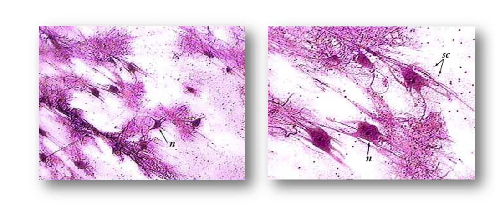|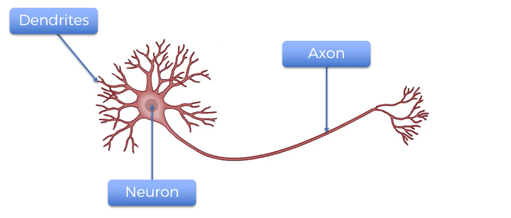|

- Dendrites : Receiver of the signal
- Axon : Transmitter of the signal

| The Neuron | The Neuron |
|---|---|
|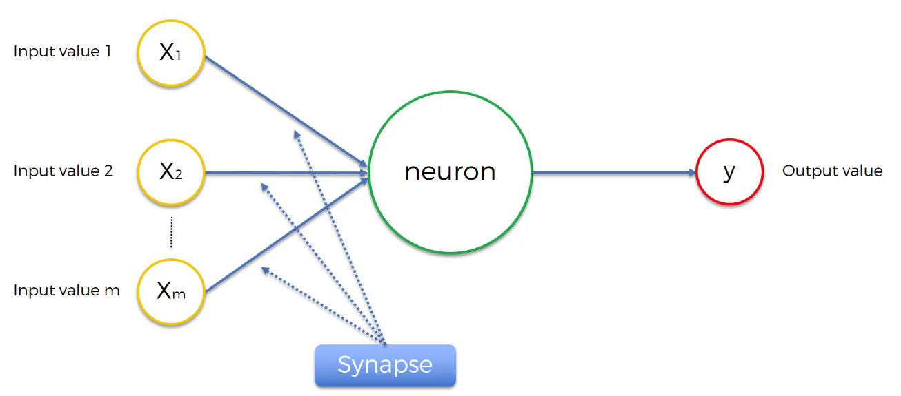|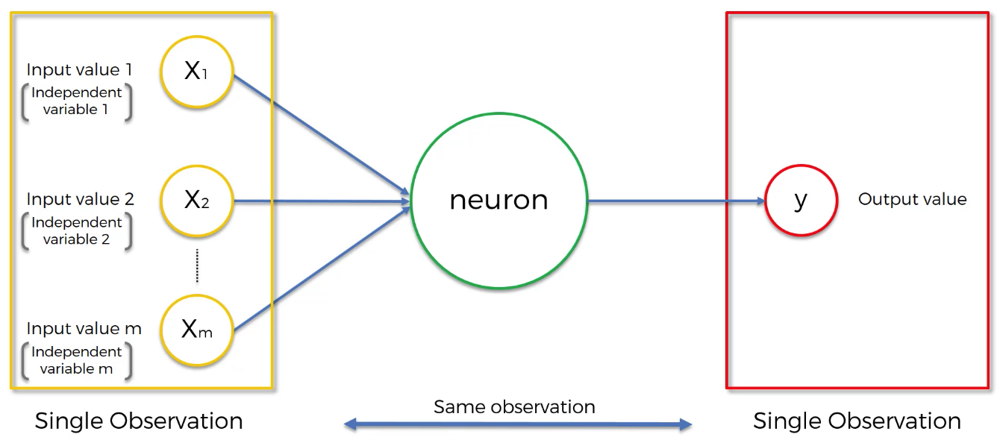|

| Step 1 | Step 2 & 3 |
|---|---|
|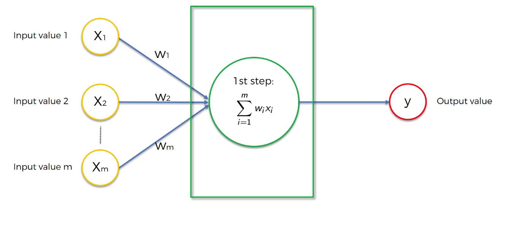|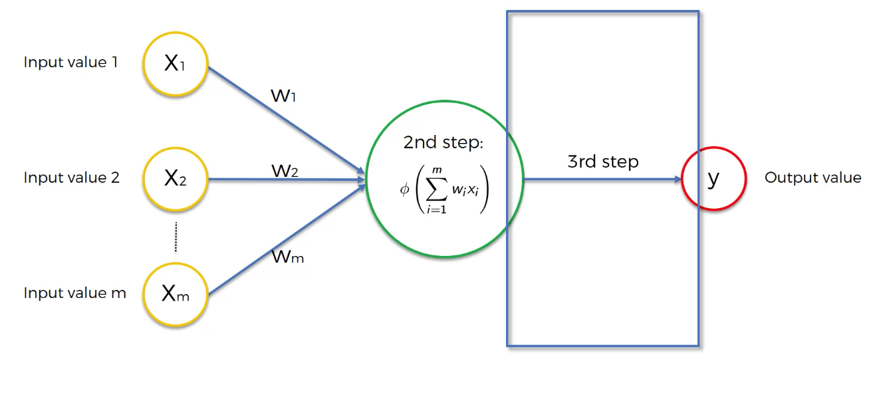|

- ## Activation functions 
	- Threshold Function
	- Sigmoid Function
	- Rectifier Function
		- Most used function in ANN
	- Hyperbolic Tangent (tanh)
	
| Threshold Function | Sigmoid Function | Rectifier Function | Hyperbolic Function |
|---|---|---|---|
|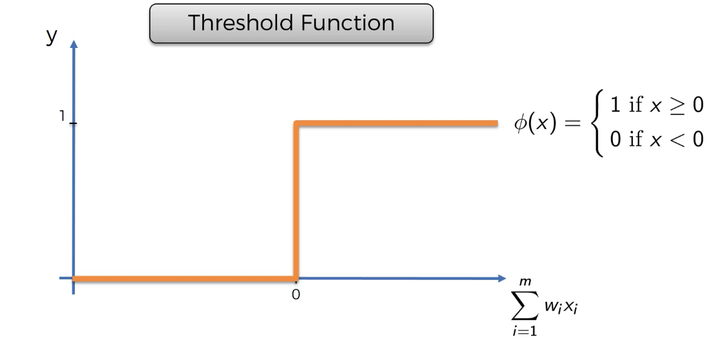|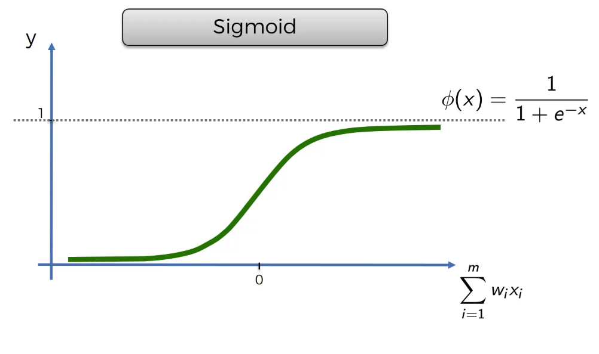|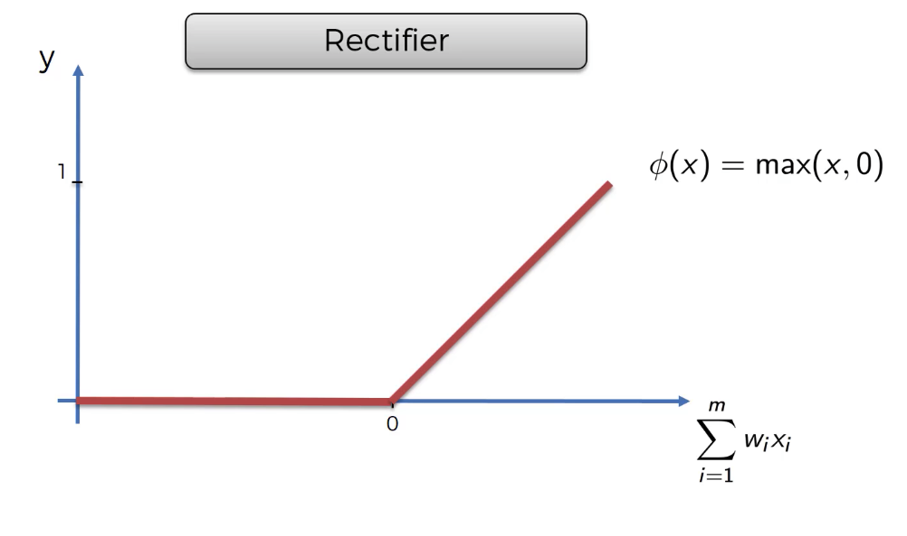|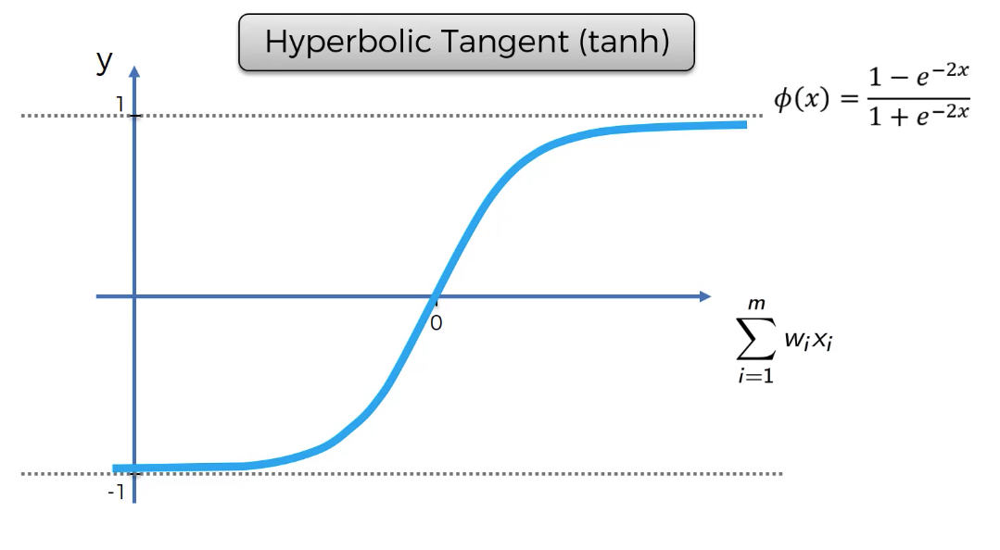|

- ## How do Neural Networks learn?
	- Lower the cost function, closer gets the y^ value to y.

| Perceptron |
|---|
||

- World's [fastest super computer](https://www.networkworld.com/article/3622923/fugaku-still-reigns-as-the-world-s-fastest-supercomputer.html) : Fagaku from Japan 

|Fagaku speed|
|---|
||

	- **PFLOPS :  floating point operations per second**
	
- ## Gradient Decent  *(Batch Gradient Descent)*
	- Here only one global minimum can be traced. if there are multiple global minimum this algorithm may fail to find optimum global minimum.
		> This will fix the Stochastic Gradient Descent

| How Gradient Decent works ? |
|---|
|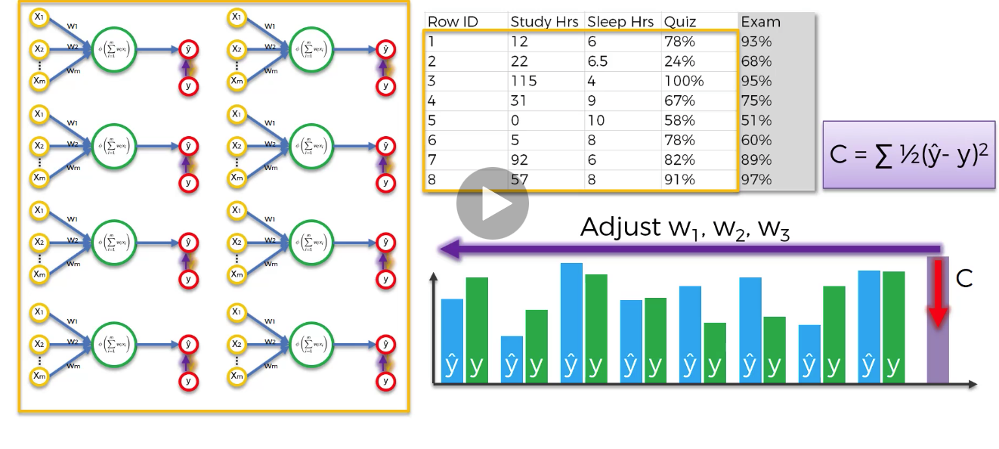|

- ## Stochastic Gradient Descent

| Differences b/w GD and SGD |
|---|
|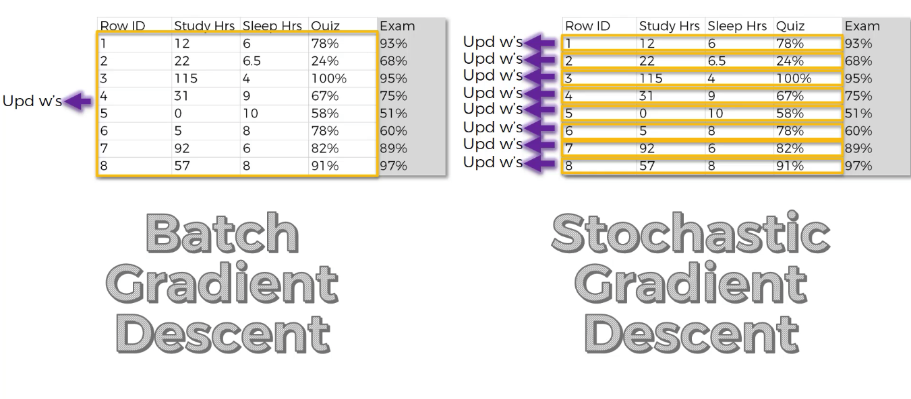|

- In SGD, we'll update weights after every sample instead of updating them at only once after all samples have been evaluated.
- This is faster and lighter although its updating weights after every single iteration and each sample.
- Here `Batch Gradient Descent` is deterministic algorithm rather then random algorithm like SGD.
- If we update weights at some random row values like : *we update weights after every 5 samples*, then its called as *MINI Batch Gradient Descent*.

- Read more... : **[Great Resource for Gradient Descent and Neural Network](https://iamtrask.github.io/2015/07/27/python-network-part2/)** 

- Training the ANN with Stochastic Gradient Descent
	- STEP 1: Randomly initialise the weights to small numbers close to 0 (but not 0). 
	- STEP 2: Input the first observation of your dataset in the input layer, each feature in one input node. 
	- STEP 3: Forward-Propagation: from left to right, the neurons are activated in a way that the impact of each neuron's activation is limited by the weights. Propagate the activations until getting the predicted result y. 
	- STEP 4: Compare the predicted result to the actual result. Measure the generated error. 
	- STEP 5: Back-Propagation: from right to left, the error is back-propagated. Update the weights according to how much they are responsible for the error. The learning rate decides by how much we update the weights. 
	- STEP 6: Repeat Steps 1 to 5 and update the weights after each observation (Reinforcement Learning). Or: Repeat Steps 1 to 5 but update the weights only after a batch of observations (Batch Learning). 
	- STEP 7: When the whole training set passed through the ANN, that makes an epoch. Redo more epochs. 
	
- [Learn more about ANN...](https://www.superdatascience.com/blogs/the-ultimate-guide-to-artificial-neural-networks-ann)