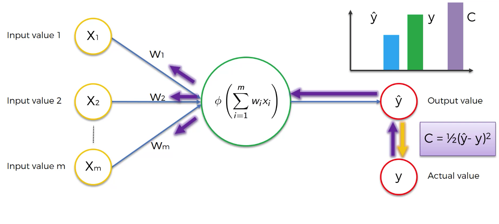

# Artifical Neural Network

- This section covered following topics :
	- The Neuron
	- The Activation Function
	- How do Neural Networks work? *(example)*
	- How do Neural Networks learn?
	- Gradient Descent
	- Stochastic Gradient Descent
	- Backpropagation
	
- ## The Neuron

|What neurons looks like |The Neuron|
|---|---|
|||

- Dendrites : Receiver of the signal
- Axon : Transmitter of the signal

| The Neuron | The Neuron |
|---|---|
|||

| Step 1 | Step 2 & 3 |
|---|---|
|||

- ## Activation functions 
	- Threshold Function
	- Sigmoid Function
	- Rectifier Function
		- Most used function in ANN
	- Hyperbolic Tangent (tanh)
	
| Threshold Function | Sigmoid Function | Rectifier Function | Hyperbolic Function |
|---|---|---|---|
|||||

- ## How do Neural Networks learn?
	- Lower the cost function, closer gets the y^ value to y.

| Perceptron |
|---|
||

- World's [fastest super computer](https://www.networkworld.com/article/3622923/fugaku-still-reigns-as-the-world-s-fastest-supercomputer.html) : Fagaku from Japan 

|Fagaku speed|
|---|
||

	- **PFLOPS :  floating point operations per second**
	
- ## Gradient Decent  *(Batch Gradient Descent)*
	- Here only one global minimum can be traced. if there are multiple global minimum this algorithm may fail to find optimum global minimum.
		> This will fix the Stochastic Gradient Descent

| How Gradient Decent works ? |
|---|
||

- ## Stochastic Gradient Descent

| Differences b/w GD and SGD |
|---|
||

- In SGD, we'll update weights after every sample instead of updating them at only once after all samples have been evaluated.
- This is faster and lighter although its updating weights after every single iteration and each sample.
- Here `Batch Gradient Descent` is deterministic algorithm rather then random algorithm like SGD.
- If we update weights at some random row values like : *we update weights after every 5 samples*, then its called as *MINI Batch Gradient Descent*.

- Read more... : **[Great Resource for Gradient Descent and Neural Network](https://iamtrask.github.io/2015/07/27/python-network-part2/)** 

- Training the ANN with Stochastic Gradient Descent
	- STEP 1: Randomly initialise the weights to small numbers close to 0 (but not 0). 
	- STEP 2: Input the first observation of your dataset in the input layer, each feature in one input node. 
	- STEP 3: Forward-Propagation: from left to right, the neurons are activated in a way that the impact of each neuron's activation is limited by the weights. Propagate the activations until getting the predicted result y. 
	- STEP 4: Compare the predicted result to the actual result. Measure the generated error. 
	- STEP 5: Back-Propagation: from right to left, the error is back-propagated. Update the weights according to how much they are responsible for the error. The learning rate decides by how much we update the weights. 
	- STEP 6: Repeat Steps 1 to 5 and update the weights after each observation (Reinforcement Learning). Or: Repeat Steps 1 to 5 but update the weights only after a batch of observations (Batch Learning). 
	- STEP 7: When the whole training set passed through the ANN, that makes an epoch. Redo more epochs. 

	
---

# **Implementation**

---

- ## Dataset : `Churn_Modelling.csv`

|RowNumber|CustomerId|Surname |CreditScore|Geography|Gender|Age|Tenure|Balance  |NumOfProducts|HasCrCard|IsActiveMember|EstimatedSalary|Exited|
|---------|----------|--------|-----------|---------|------|---|------|---------|-------------|---------|--------------|---------------|------|
|1        |15634602  |Hargrave|619        |France   |Female|42 |2     |0        |1            |1        |1             |101348.88      |1     |
|2        |15647311  |Hill    |608        |Spain    |Female|41 |1     |83807.86 |1            |0        |1             |112542.58      |0     |
|3        |15619304  |Onio    |502        |France   |Female|42 |8     |159660.8 |3            |1        |0             |113931.57      |1     |
|4        |15701354  |Boni    |699        |France   |Female|39 |1     |0        |2            |0        |0             |93826.63       |0     |
|5        |15737888  |Mitchell|850        |Spain    |Female|43 |2     |125510.82|1            |1        |1             |79084.1        |0     |
|6        |15574012  |Chu     |645        |Spain    |Male  |44 |8     |113755.78|2            |1        |0             |149756.71      |1     |
|7        |15592531  |Bartlett|822        |France   |Male  |50 |7     |0        |2            |1        |1             |10062.8        |0     |
|8        |15656148  |Obinna  |376        |Germany  |Female|29 |4     |115046.74|4            |1        |0             |119346.88      |1     |
|9        |15792365  |He      |501        |France   |Male  |44 |4     |142051.07|2            |0        |1             |74940.5        |0     |
|10       |15592389  |H?      |684        |France   |Male  |27 |2     |134603.88|1            |1        |1             |71725.73       |0     |
