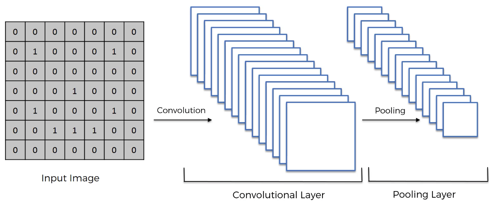

# Convolutional Neural Network

- What will be covered in this section : 
	- What are convolutional neural networks?
	- Step 1 : Convolutional Operation
	- Step 1(b) : ReLU Layer (Rectified Linear Unit)
		> Linearity is not good, we wan't non linearity in our model
	- Step 2 : Pooling
		- max,sum and min pooling
	- Step 3 : Flattening
	- Step 4 : Full Connection
	- Summary
	- Softmax & Cross-Entropy
	
- ## Step 1
	a. Convolution
	
	> 
	- `Input Image` x `Feature detector/kernel/filter` = `Feature Map/Vold Feature/Activation Map`
	
	b. ReLU Layer
	- Rectified Linear Unit
	> 	- this if for breaking linearity.

- ## Step 2 Pooling
	- also called *Down Sampling*
	- **SPATIAL INVARIANCE** : Shift Invariance simply refers to the 'invariance' that a CNN has to recognising images. It allows the CNN to detect features/objects even if it does not look exactly like the images in it's training period. Shift invariance covers 'small' differences, such as movements shifts of a couple of pixels.
	- Types of pooling : 
		- max pooling
		- mean pooling
		- sum pooling
	- preventing overfitting
	> 
	- [Number visualiser with pooling operation](https://www.cs.ryerson.ca/~aharley/vis/conv/flat.html)
	
- ## Step 3 Flattening

	> 
	
	> 

	> 

- ## Step 4 Full Connection

	> 
	
- ## Summary
	
	> 
	
- ## Softmax and Cross-Entropy

	- # Softmax
		- to normalise real values of output to sum all ans to 1.
		> 
		
	- # Cross Entropy
		> 
		
		> 
		
		- Cross entropy can access even a small error unlike mean square error.
		- When we are doing regression we should go with mean square error. But when we are doing classification, we should go with cross entropy.
		
		- [read more...](https://rdipietro.github.io/friendly-intro-to-cross-entropy-loss/)
		
		
## [learn more...](https://www.superdatascience.com/blogs/the-ultimate-guide-to-convolutional-neural-networks-cnn)